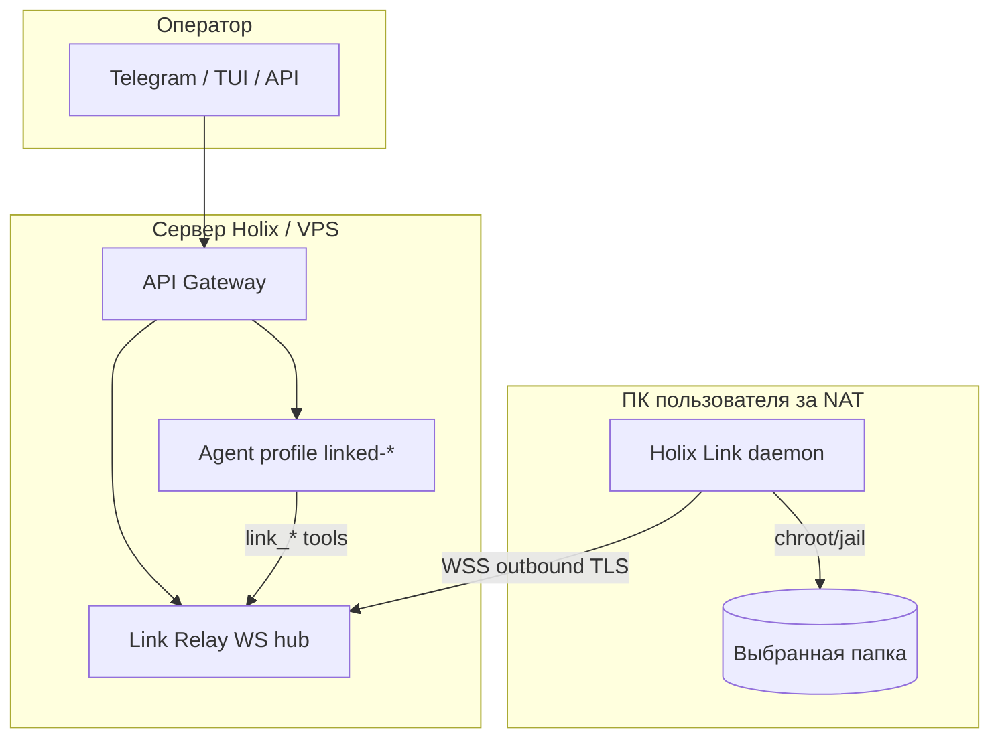

# Holix Link — удалённый доступ агента к папке пользователя

**Статус:** черновик на согласование (реализация не начата)  
**Ветка:** `feature/remote-folder-agent`  
**Версия документа:** 0.1  
**Дата:** 2026-06-12

---

## 1. Проблема

Сейчас Holix-агент работает **локально** на машине, где установлен CLI/gateway: файловые инструменты, терминал и workspace jail привязаны к `~/.holix/profiles/<name>/`. Удалённый оператор (другой сервер, Telegram, веб-UI) не может безопасно работать с **произвольной папкой на ПК пользователя** без:

- проброса портов и открытия gateway в интернет;
- полной установки Holix на клиентской машине с тем же уровнем доступа, что и у «основного» агента.

Нужно **простое приложение-компаньон**: пользователь выбирает одну папку, подключается к уже существующему Holix (сервер / gateway), агент на стороне сервера видит только эту папку — **за NAT**, с **шифрованием** и **простой отвязкой**.

---

## 2. Предлагаемое решение: **Holix Link**

Лёгкий клиент **Holix Link** (отдельный пакет или extra `Holix[link]`) + расширение gateway **Link Relay**.

| Роль | Где работает | Задача |
|------|--------------|--------|
| **Holix Link (клиент)** | ПК/ноутбук пользователя | Выбор папки, исходящее соединение к gateway, исполнение файловых операций только внутри jail |
| **Link Relay (сервер)** | Gateway на VPS / `holix-agent.ru` | Приём сессий Link, маршрутизация к агенту профиля `linked-<id>` |
| **Агент** | Профиль на gateway | Использует виртуальные инструменты `link_read_file`, `link_list_dir`, … вместо прямого FS |

**Ключевая идея:** клиент **сам** устанавливает исходящее соединение (WebSocket over TLS). Входящих портов на стороне пользователя не нужно — работает за NAT/CGNAT.

Синхронизация целой папки на сервер **не используется** в MVP: агент работает с **живым удалённым каталогом** через RPC (меньше диска на сервере, актуальные данные). Опциональная «офлайн-копия» — фаза 3.

---

## 3. Цели и ограничения

### Цели (MVP)

- Установка клиента за **1–2 команды** (`curl … | bash` или `pipx install Holix-Link`).
- Пользователь **явно выбирает папку** (и может сменить только после переподключения).
- **Pairing** по одноразовому коду / QR (как Telegram access request).
- Трафик **TLS 1.3** + подписанные сообщений на уровне приложения.
- Работа **за NAT** (outbound-only).
- На сервере — **отдельный профиль** или режим `link` с workspace jail = удалённая папка.
- **Отзыв** связи с любой стороны, аудит операций.

### Не входит в MVP

- Произвольный shell на клиентской машине (только файлы; терминал — фаза 2 с отдельным согласием).
- Доступ ко всей файловой системе клиента.
- P2P без relay-сервера (рассмотрено, отложено).
- Нативные GUI macOS/Windows (сначала CLI + опционально минимальный web wizard на `127.0.0.1`).

### Нефункциональные требования

- Latency: list/read &lt; 2 с на типичном канале; streaming read для больших файлов.
- Переподключение после sleep/reboot клиента без повторного pairing (пока не отозван ключ).
- Совместимость: Python 3.12+, Linux/macOS/Windows.

---

## 4. Пользовательские сценарии

### 4.1 Подключение (pairing)

1. Админ на сервере: `holix link create --profile support` → код `LINK-7K3M-9Q2P` (TTL 10 мин).
2. Пользователь на ПК: `holix-link pair LINK-7K3M-9Q2P --folder ~/Projects/acme`.
3. Клиент показывает fingerprint сервера; пользователь подтверждает.
4. Сервер создаёт запись `link_id`, профиль `linked-acme` с `workspace_root` = виртуальный корень.
5. Агент в Telegram/веб: «Папка Acme подключена».

### 4.2 Работа агента

- Оператор пишет в Telegram профиля `support`: «Прочитай README в корне».
- Агент вызывает `link_read_file("README.md")` → RPC → клиент читает `~/Projects/acme/README.md` → ответ.

### 4.3 Отзыв

- `holix link revoke <link_id>` на сервере **или** `holix-link disconnect` на клиенте.
- Все сессии и refresh-токены инвалидируются.

---

## 5. Архитектура



### Поток данных

1. **Control plane:** pairing, revoke, status — HTTP на gateway (`/v1/link/*`).
2. **Data plane:** постоянный **WebSocket** клиент → relay; запросы файловых операций с `request_id`, таймаут, размерные лимиты.
3. **Агент** не ходит на клиент напрямую — только через `LinkBridge` в процессе gateway.

---

## 6. Безопасность

### 6.1 Модель угроз

| Угроза | Митигация |
|--------|-----------|
| Перехват трафика | TLS 1.3 (WSS), certificate pinning опционально |
| Подмена сервера | Отображение fingerprint при pairing; TOFU + опциональный `HOLIX_LINK_TRUSTED_FP` |
| Компрометация pairing-кода | TTL 10 мин, одноразовость, rate limit |
| Расширение scope | Жёсткий `workspace_root` на клиенте; все пути нормализуются и проверяются (`..` запрещён) |
| Утечка через агента | Отдельный профиль link; без терминала в MVP; whitelist расширений файлов опционально |
| Украденный device token | Refresh rotation, revoke, короткий TTL access token |

### 6.2 Шифрование (слои)

| Слой | Механизм |
|------|----------|
| Транспорт | TLS 1.3 (обязательно) |
| Аутентификация сессии | Ed25519 keypair на клиенте при первом pair; сервер хранит public key |
| Сообщения RPC | JSON + HMAC-SHA256 или подпись Ed25519 (`link_session_key`) |
| Секреты at rest | `~/.holix/link/credentials.json` chmod 600; OS keychain — фаза 2 |

Полное E2E без расшифровки на relay **не требуется в MVP**, если relay на том же доверенном gateway. Для multi-tenant SaaS — фаза 2: envelope encryption per link.

### 6.3 Права на клиенте

- Переиспользовать **`workspace_jail`** из `core/tools/` — тот же код нормализации путей.
- Запрет symlink-escape (resolve realpath внутри jail).
- Лимиты: max file size read (например 10 MB MVP), max list entries, rate limit RPC/мин.

---

## 7. Обход NAT

**Выбранный подход:** persistent **outbound WebSocket** от клиента к `wss://<gateway>/v1/link/ws`.

| Альтернатива | Почему не MVP |
|--------------|---------------|
| Reverse SSH tunnel | Сложная установка для пользователя |
| WireGuard | Нужны права админа, конфиг сети |
| STUN/TURN P2P | Сложность, нестабильность CGNAT |
| Tailscale/ZeroTier | Внешняя зависимость, не «одно приложение Holix» |

**Reconnect:** exponential backoff; при долгом offline агент видит статус `link_offline`; очередь запросов не буферизуется (fail fast).

**Self-hosted:** relay встроен в существующий `holix gateway` — отдельный порт не нужен, тот же TLS termination на nginx.

---

## 8. Установка (UX)

### Клиент (пользователь)

```bash
# Вариант A — лёгкий пакет
pipx install Holix-Link

# Вариант B — из репозитория
curl -fsSL https://holix-agent.ru/install-link.sh | bash

holix-link wizard   # выбор папки, pairing, фоновый daemon
holix-link status
holix-link disconnect
```

### Сервер (уже есть Holix)

```bash
holix link create --profile support --ttl 10m
holix link list
holix link revoke <id>
```

### systemd (Linux)

`holix-link install-service` — user unit, автозапуск после pair.

---

## 9. Компоненты кодовой базы

| Компонент | Путь (план) | Описание |
|-----------|-------------|----------|
| `integrations/link/` | новый | Протокол, клиент daemon, jail executor |
| `api/routers/link.py` | новый | REST + WebSocket relay |
| `core/tools/link_fs.py` | новый | `link_read_file`, `link_write_file`, `link_list_directory` |
| `cli/commands/link.py` | новый | `holix link *` |
| `cli/link_worker.py` | новый | фоновый процесс (аналог `gateway_worker`) |
| `docs/en|ru/LINK.md` | новый | пользовательская документация |

Переиспользование:

- `workspace_jail` / path guards из `core/tools/`
- `ProfileManager`, pairing UX как в `integrations/telegram/access_approval`
- `gateway_daemon` / supervisor pattern для фонового link worker на сервере не нужен — WS внутри uvicorn

---

## 10. Протокол (черновик)

### WebSocket: клиент → сервер (после pair)

```json
{"type": "rpc_result", "id": "uuid", "ok": true, "payload": {"entries": ["a.txt", "src/"]}}
```

### WebSocket: сервер → клиент

```json
{"type": "rpc_call", "id": "uuid", "op": "list_dir", "path": "src", "limit": 200}
```

Операции MVP: `list_dir`, `read_file`, `write_file`, `stat`, `mkdir` (опционально выкл.), `delete` (выкл. по умолчанию).

---

## 11. План реализации по фазам

> **Важно:** код пишется только после согласования этого документа.

### Фаза 0 — Согласование (текущий этап)

- [ ] Утвердить название (Holix Link / другое)
- [ ] Утвердить: только файлы в MVP или нужен read-only
- [ ] Утвердить: отдельный PyPI-пакет `Holix-Link` vs extra `Holix[link]`
- [ ] Утвердить модель хостинга relay (только self-hosted gateway / managed cloud)

### Фаза 1 — MVP (оценка 3–4 недели)

| PR | Содержание | Зависимости |
|----|------------|-------------|
| **PR-1** | Спецификация протокола + типы (`integrations/link/protocol.py`) | — |
| **PR-2** | Gateway: `POST /v1/link/pair`, `WS /v1/link/connect`, хранение `links.db` | PR-1 |
| **PR-3** | Клиент: `holix-link pair`, daemon, jail executor | PR-1, PR-2 |
| **PR-4** | Agent tools `link_*` + профиль `linked-*` auto setup | PR-2 |
| **PR-5** | CLI `holix link create|list|revoke`, doctor checks | PR-2 |
| **PR-6** | Тесты: path escape, pairing TTL, offline, revoke | PR-3, PR-4 |
| **PR-7** | Документация EN/RU + `holix docs build` | PR-5 |

**Критерий готовности MVP:** пользователь за NAT подключает папку; оператор через Telegram-профиль на сервере читает файл из этой папки.

### Фаза 2 — Усиление (2 недели)

- Read-only режим по умолчанию + toggle `holix link grant write`
- OS keychain для credentials
- Ограничение MIME/расширений
- Статус в `holix gateway status` / Prometheus метрики
- Уведомление клиенту при каждой записи файла

### Фаза 3 — Опционально

- Терминал в sandbox (ограниченный whitelist на клиенте) — отдельное согласие
- Selective sync кэша для офлайн-read
- Desktop tray app (Tauri/Electron)
- Managed relay для пользователей без своего VPS

---

## 12. Альтернативы (кратко)

| Подход | Плюсы | Минусы |
|--------|-------|--------|
| **Sync папки на сервер** | Проще для агента (локальный FS) | Диск, задержка, конфликты, не «живые» данные |
| **Только SSH reverse tunnel** | Зрелый протокол | Сложная установка, ключи SSH для пользователей |
| **Расширить `holix tui --web`** | Уже есть web UI | Нужен входящий порт / VPN; не NAT-friendly |
| **Telegram-only file upload** | Уже работает | Не папка, не непрерывный доступ |

**Рекомендация:** outbound Link Relay — лучший баланс простоты установки и безопасности для Holix.

---

## 13. Открытые вопросы для согласования

1. **Имя продукта:** Holix Link / Holix Remote / Holix Folder Bridge?
2. **MVP write:** разрешать запись файлов сразу или только read-only?
3. **Пакет:** отдельный `Holix-Link` на PyPI (меньше размер) или `pip install Holix[link]`?
4. **Кто может создавать pair-код:** только admin gateway или любой владелец профиля?
5. **Лимит одновременных link на профиль:** 1 папка = 1 link или несколько?
6. **Интеграция с Telegram:** отдельный бот для «клиентских» машин или тот же бот с ролью link?

---

## 14. Следующий шаг после согласования

1. Зафиксировать ответы на §13 в этом файле (версия 1.0).
2. Создать issue/PR stack по таблице Фазы 1.
3. Начать с **PR-1** (протокол + тесты контракта без сети).

---

*Документ подготовлен для ветки `feature/remote-folder-agent`. Изменения в коде до approval не вносятся.*